# NUA Fashion

A modern fashion e-commerce application built with React and Vite. The project focuses on delivering a clean shopping experience while implementing common e-commerce features such as product browsing, variant selection, shopping cart management, and a simple checkout flow.

---

## Live Demo

https://nua-fashion.netlify.app

---

## Repository

https://github.com/paruljamwal/NUA-Fashion

---

## Screenshots

### Home

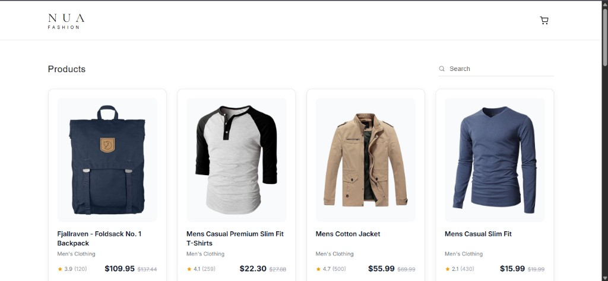

### Product Search

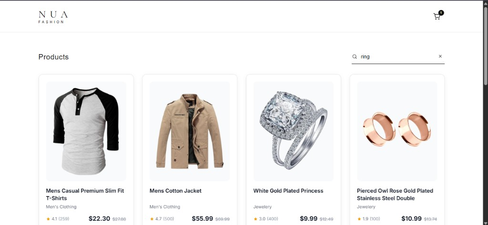

### Search Empty State

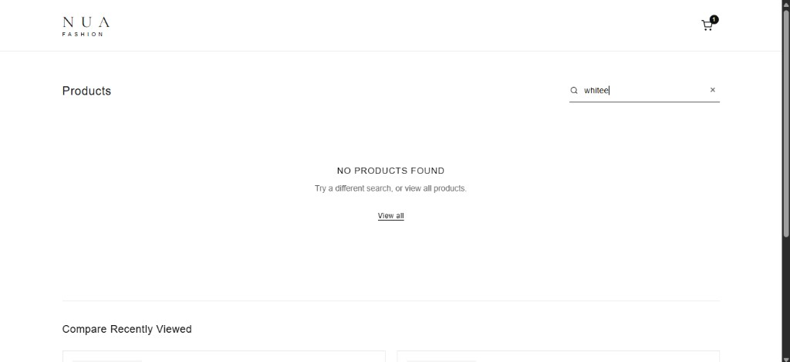

### Product Details

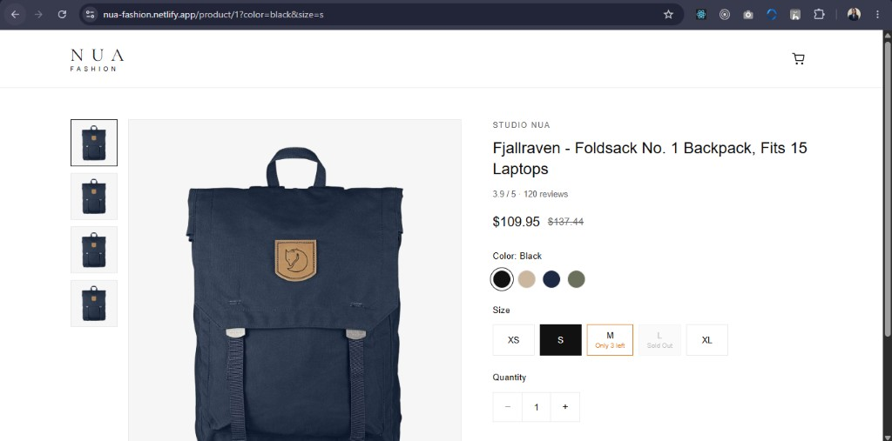

### Add to Cart

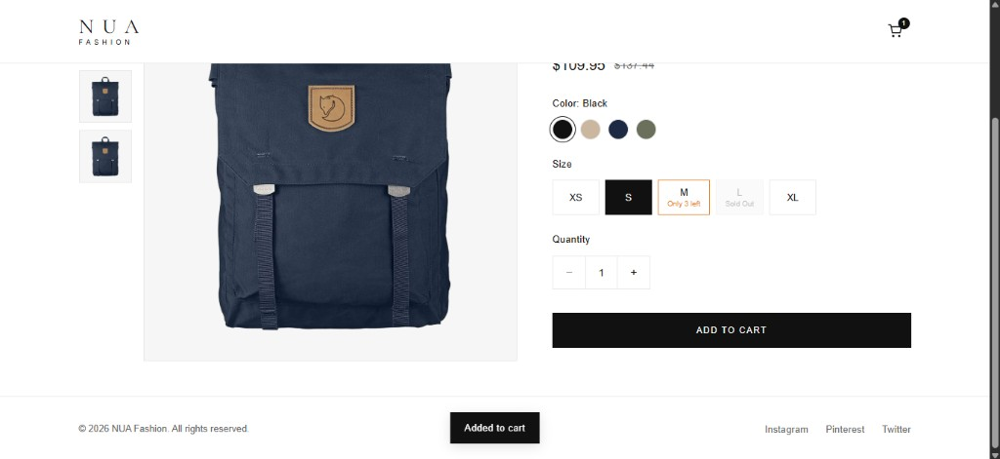

### Shopping Cart

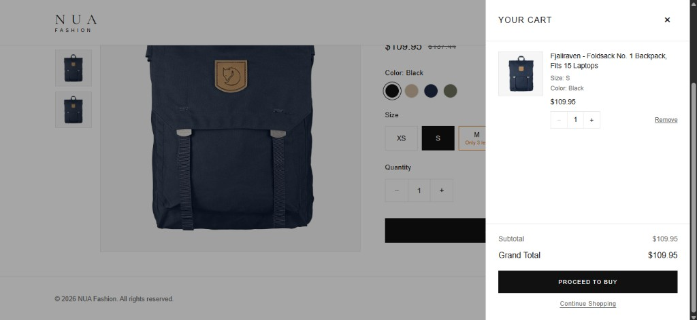

### Empty Cart

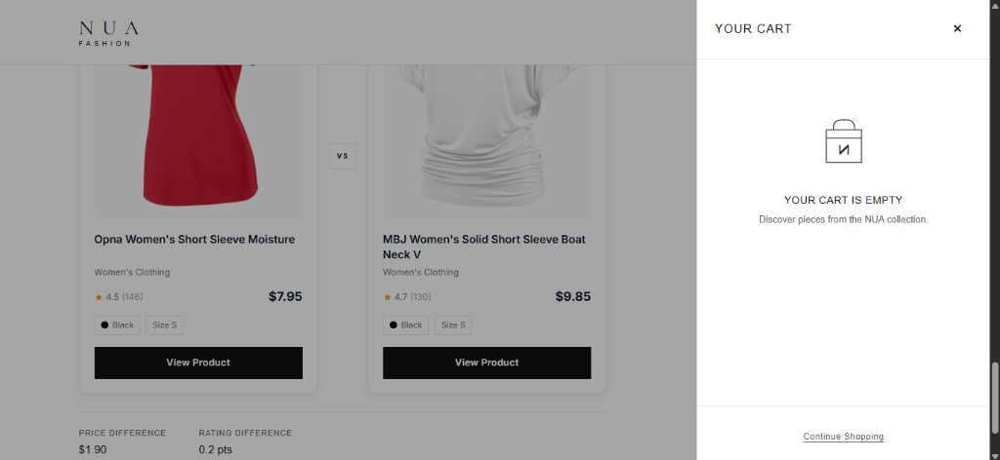

### Compare Recently Viewed

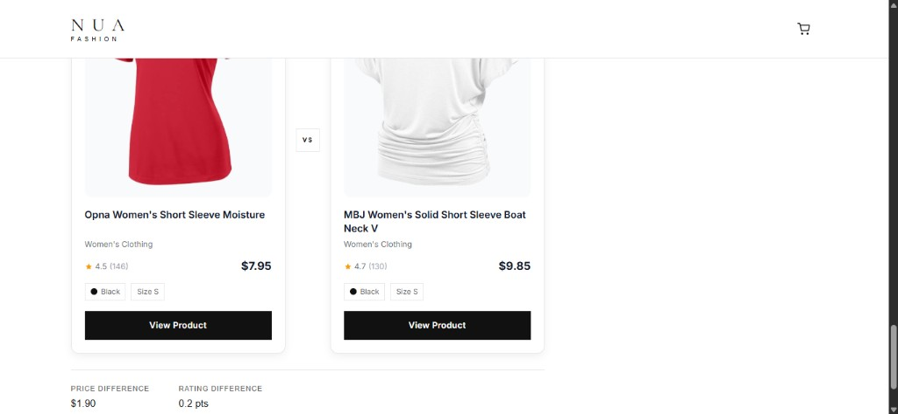

### Checkout

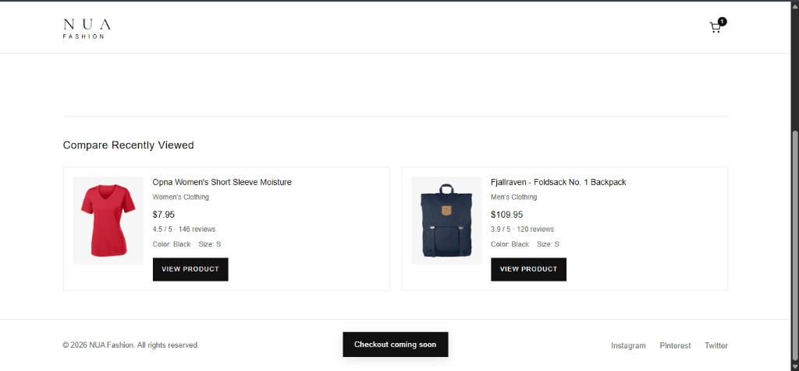

---

## Performance (Before Optimization)

Baseline Lighthouse, build, and network results captured before any performance work.

### Lighthouse — Mobile

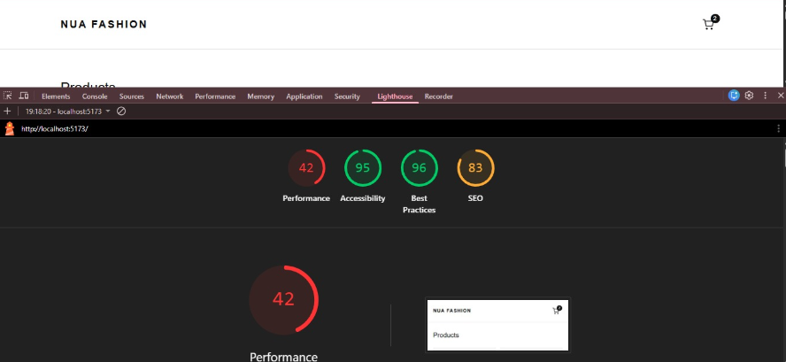

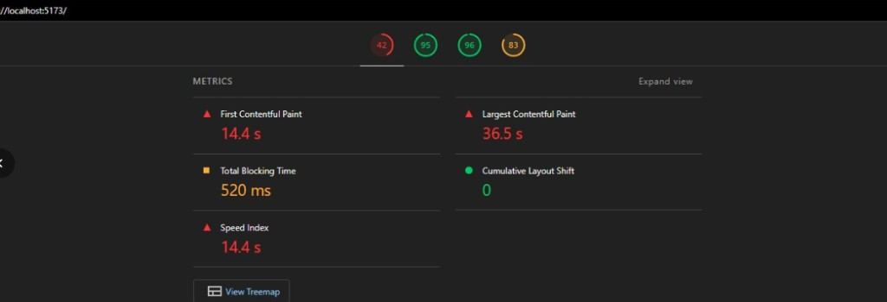

### Lighthouse — Desktop

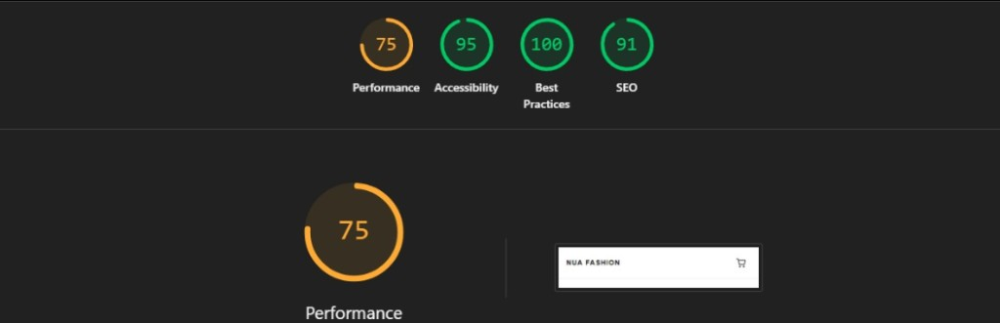

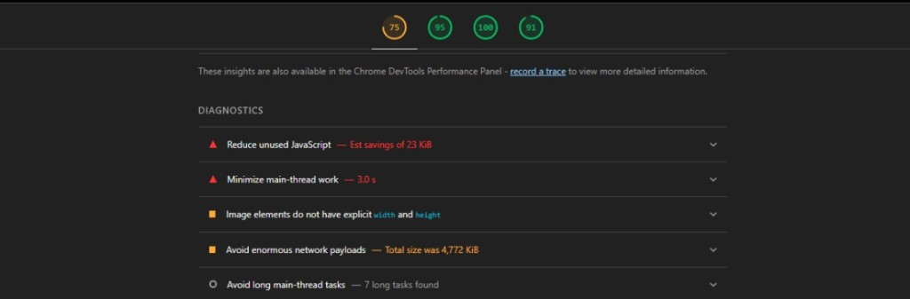

### Production Build

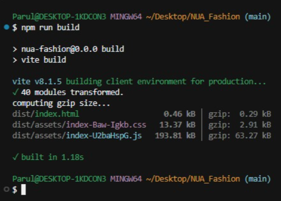

### Chunking / Network

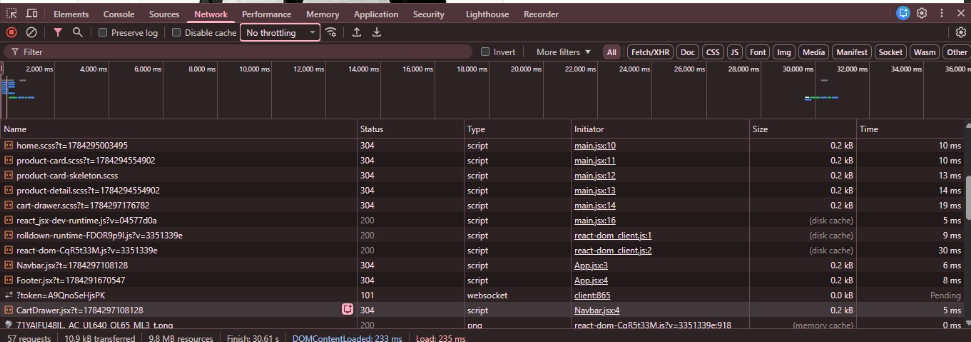

---

## Performance (After Optimization)

Lighthouse and build results after performance improvements (lazy routes, code splitting, and related optimizations).

### Lighthouse — Desktop

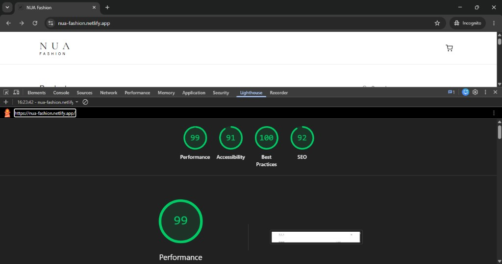

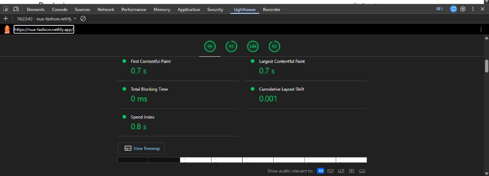

### Lighthouse — Mobile

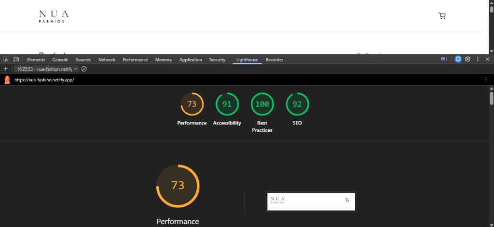

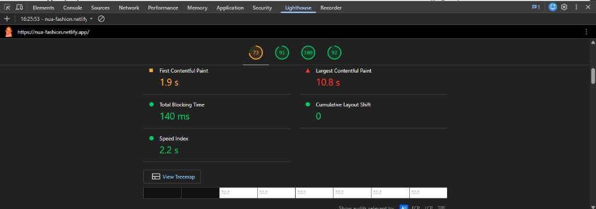

### Production Build

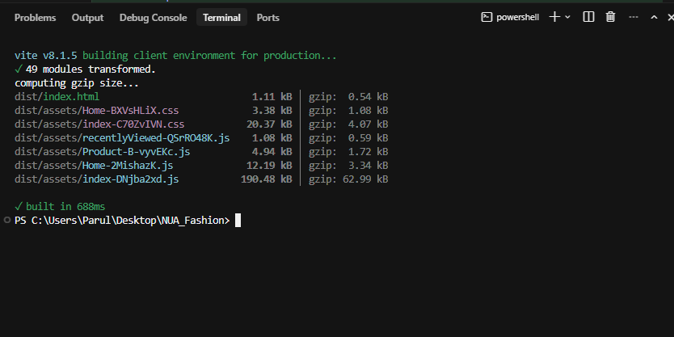

---

## Features

- Product listing
- Product search
- Category filtering
- Client-side pagination
- Product details page
- Size & color variants
- Deep-linkable product variants using URL query parameters
- Shopping cart
- Branded empty cart state with NUA illustration
- Quick Add drawer
- Quantity management
- Mock async Add to Cart flow
- Loading and error states
- Checkout page
- Compare recently viewed products
- Responsive design
- Lighthouse optimization

---

## Tech Stack

- React
- Vite
- React Router
- Context API
- SCSS

---

## Getting Started

Clone the repository

```bash
git clone https://github.com/paruljamwal/NUA-Fashion.git
```

Install dependencies

```bash
npm install
```

Run development server

```bash
npm run dev
```

Build for production

```bash
npm run build
```

Preview production build

```bash
npm run preview
```

---

## Folder Structure

```text
src
│
├── assets
├── components
├── context
├── data
├── pages
├── services
├── styles
├── utils
├── App.jsx
└── main.jsx
```

---

## Design Decisions

A few implementation highlights:

- React Context is used for shared cart state.
- Local component state manages page-specific UI.
- Product variants are synchronized with URL query parameters for deep linking.
- Client-side pagination is used due to the small dataset.
- A mock async API simulates the Add to Cart flow.
- The empty cart uses a lightweight custom SVG illustration aligned with the NUA brand.

More details are available in **DECISIONS.md**.

---

## Future Improvements

- Real backend integration
- Authentication
- Wishlist
- Product recommendations
- Recently viewed products
- Unit & integration tests
- Image optimization
- Server-side pagination

---

## Author

**Parul Jamwal**
